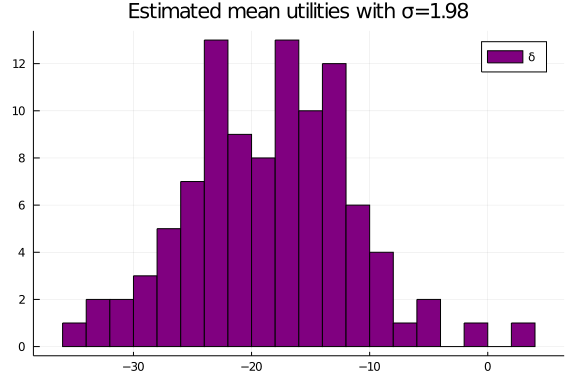
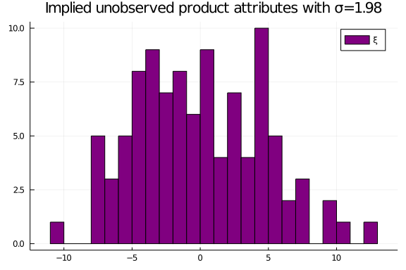
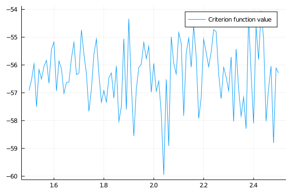
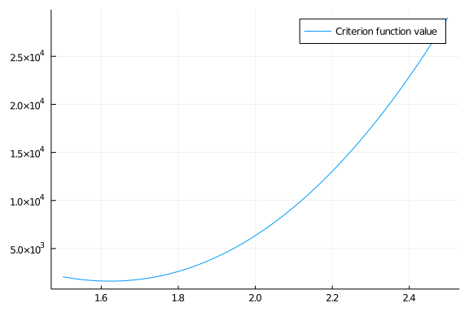

```{r setup, include=FALSE}
knitr::opts_chunk$set(echo = TRUE, fig.align = 'center', fig.width = 5)
```

```{r julia, include=FALSE, eval=FALSE, results='hide'}
library(JuliaCall)
julia<-julia_setup(JULIA_HOME = "/Applications/Julia-1.5.app/Contents/Resources/julia/bin")
JuliaCall::julia_markdown_setup()
```

# Homogeneous consumers model

I used Julia for this problem set. This solution and the code can be found in my github [repo](). My true parameters are $\{\beta,\alpha,\sigma, \eta\}=\{2.5,4.0,2.0,1.5\}$.

a.  Description of the simulated data is summarized in table 1. Likewise, the correlations between the unobserved and observed variables are described in table 2.


```{=latex}
\input{tables/t1}
```
```{=latex}
\input{tables/cort}
```
```{asis, eval=knitr::is_html_output(), echo=FALSE}
|    |         x |        w |
| ---:| ---------:| --------:|
|   p |  $0.6889$ | $0.5517$ |
|  $\xi$ | $0.07454$ | $0.1114$ |
|  $\omega$ |  $0.2141$ | $0.1257$ |
```

b.  Table 3 displays the results for the estimates of $\alpha$ and $\beta$, ignoring the endogeneity of prices in columns (1) and (2).

c.  Columns (3)-(8) display the results for different variations of instrumental variables estimation.

> **Discussion:** The results that are closer to the true parameters are the ones from the model (5). Model (5) includes the intercept in both stages. Not surprisingly, OLS is biased and performs poorly in comparison to IV when prices are endogenous.

```{=latex}
\input{tables/t2}
```
# Heterogeneous consumers model (BLP)

For these simulations, I keep the values for the true parameters. Namely, $\{\beta,\alpha,\sigma, \eta\}=\{2.5,4.0,2.0,1.5\}$.

a.  Table 4 describes the simulated data with 10,000 heterogeneous agents. Table 5 describes the correlation between the observed and unobserved variables for this new draw.

```{=latex}
\input{tables/t4}
```
```{=latex}
\input{tables/cort2}
```
b.  The estimates of the OLS regression assuming homogeneous taste parameters are shown in table 6. We can see that simple OLS is biased when we do not account for the heterogeneity of the taste parameters. In particular, $\beta$ is being pushed up, whereas $\alpha$ is pushed down. In contrast to problem 1, using the cost shifters as instruments and doing a simple IV in reduced form does not help solve the endogeneity problem.

```{=latex}
\begin{table}[htb]
\centering
\caption{OLS results assuming homogeneous taste parameters}
  \input{tables/ols_blp}
\end{table}
```

c.  I started fixing $\sigma= 1.98$ for the BLP fixed-point algorithm. I set the outside good share greater than 20% and used these values as the 'observed' shares, $s_j$. So, for initial values, I set $\delta_0=log(s_j)-log(s_0)$. Figure 1 shows the distribution of the recovered mean utilities ($\hat{\delta}$).

{width=70%}

d. Table 7 shows estimates for $\hat{\alpha}$ and $\hat{\beta}$. We can observe that the best model is the IV2S (5).

```{=latex}
\begin{table}[htb]
\centering
\caption{Using estimated mean utilities to recover $\alpha$ \& $\beta$}
  \input{tables/t7}
\end{table}
```

e. Therefore, using estimates of table 7, column (5), the implied product attributes are graphically displayed in figure 2.

{width=70%}

f. Following BLP, I defined the matrix of instruments as $Z = \left[ \mathbf{1} \; \sum_{r \ne j \notin \mathcal{F}_f} \mathbf{x}_{rk} \; \sum_{r \ne j \notin \mathcal{F}_f} \mathbf{w}_{rk}    \right]$. That is, the vector of ones, the sum of all the characteristics of the other products except its own, and the sum of all of the cost shifters of the other products except its own. This implicitly assumes that each product is produced by one firm. Therefore, my moment condition is $G=E[Z\hat{\xi}]$, and the criterion function becomes:

$$
\| G\| = Z\hat{\xi}'WZ'\hat{\xi}
$$
\hspace{20pt} where W is the identity matrix.


g. Then, I repeat the process for the grid $\sigma_i$ for $i\in[1.5,2.5]$ increasing in steps of 0.01. So, a total of 100 points. Figure 3 displays the log of the value of the criterion function for all the grid. The minimum value is reached at $\sigma=2.06$, which is closest to the true value 2. Finally, table 8 displays the corresponding values for the minimum value of the criterion function. Estimates are very close to the true parameters.


{width=70%}

```{=latex}
\begin{table}[htb]
\centering
\caption{Using estimated mean utilities to recover $\alpha$ \& $\beta$}
  \input{tables/t8}
\end{table}
```

\hspace{20pt}  As an additional exercise, Berry mentions that second and higher order basis functions are highly collinear with instruments that are similar to ours. Therefore, we ran the whole exercise with  $Z = \left[ \mathbf{1} \; (\sum_{r \ne j \notin \mathcal{F}_f} \mathbf{x})^2 \; (\sum_{r \ne j \notin \mathcal{F}_f} \mathbf{w}_{rk})^2    \right]$. The value of the criterion function with these instruments for the whole grid is displayed in figure 4. The corresponding estimates to the lowest value are shown in table 9.

{width=70%}


```{=latex}
\begin{table}[htb]
\centering
\caption{Recovered $\alpha$ \& $\beta$ with different set of instruments}
  \input{tables/t9}
\end{table}
```

h. From first problem we can observe that OLS is biased because of endogeneity of prices and unobserved product characteristics. In that case, IV could help us to identify the parameters using the cost shifter as instrument. However, when we have heterogeneous taste parameters, IV is not longer enough. The BLP algorithm helped us recover the parameters of interest nicely.

> **Discussion:** Even tough BLP estimates were not very precise, the true parameters were inside the confidence intervals of the estimates. This was true even when we changed the instruments. In the case of $\sigma$, we didn't estimated the s.e. because it was outside of the scope of the problem set, we could expect that both reported estimates were not different from the true parameter and from each other.


