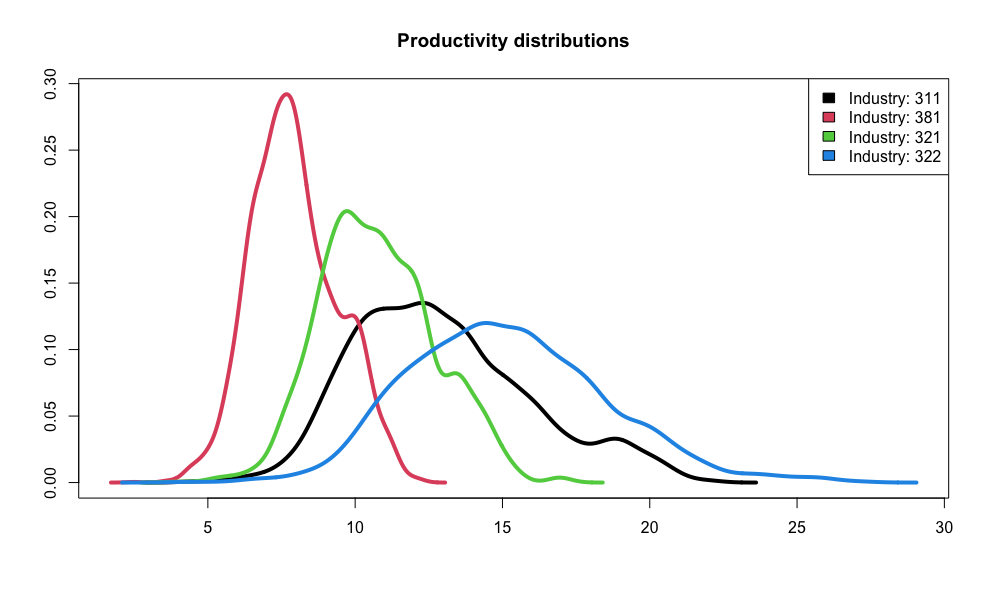
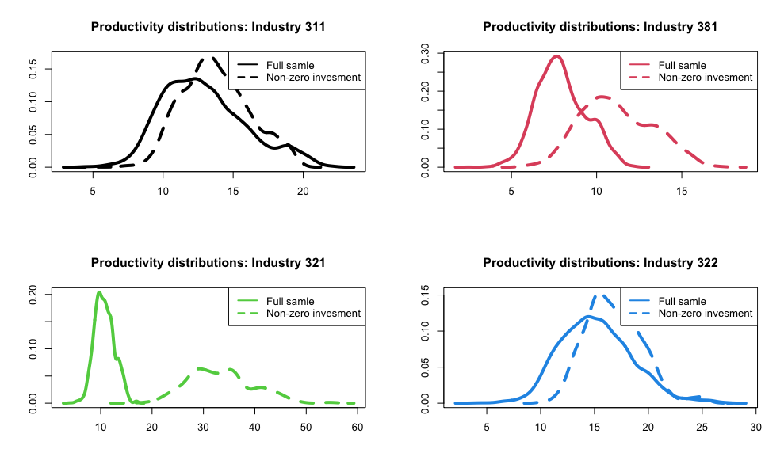
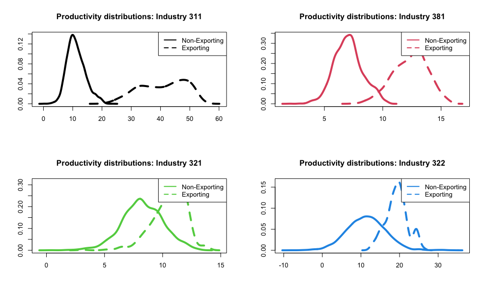
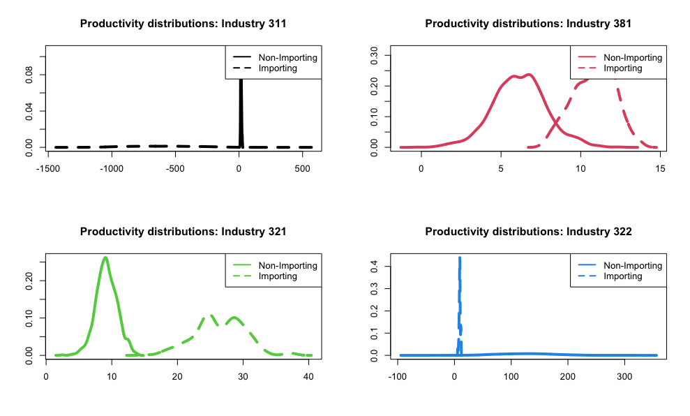

```{r setup, include=FALSE}
knitr::opts_chunk$set(echo = FALSE, fig.align = 'center', fig.width = 5)
library(tidyverse)
library(knitr)
library(kableExtra)
load("../prod.RData")

```

# Introduction {-}

For this assignment, I hard-coded everything from scratch in `R`. It didn't cross my mind that someone might have already coded this estimation procedure. In any case, this allowed me to use in the first stage a nice tool from Machine Learning (ML), called Multivariate Adaptive Regression Splines (MARS). Intuitively, this algorithm creates automatically a piecewise linear model. MARS performs well in comparison to other non-parametric non-linear interpolation routines. The advantage is that the algorithm splits the variable space optimally. That is, it searches over the best possible partition of the variables fed into it. For the second stage, I used an optimization package called `optimx`.

One of the challenges to code everything from scratch was the estimation of the standard errors.  These are usually bootstrapped as in Levinsohn and Petrin, and discussed by Ackerberg et al. The challenge is to bootstrap from panel data respecting the structure. In our case, it is also important to consider the assumption on the productivity's Markovian process. One suggestion is to bootstrap by block. Alternatively, we can also do *jackknife* resampling, which is what I ended up doing. In the *jackknife* procedure, I removed randomly one firm with all its time observations per iteration. I resampled 100 times, then I estimated the standard errors from the distribution of coefficients. Ideally, I would have liked to jackknife over the entire sample, not just over 100 randomly selected firms. However, the procedure was taking too long.

This report and the code can be found in my GitHub [repo](https://github.com/hans-mtz/EmpiricalIO/tree/main/PS2).


# ACF production function estimation

1. I used the ACF estimation procedure using intermediate input as the proxy variable estimator, assumed a Cobb-Douglas functional form in logs, and took the log of the real gross domestic output as the production function to estimate. Table 1 displays the coefficient estimates with their standard errors per industry; table 2 the summary statistics about the distribution of productivity. Figure 1 shows the distribution of the four industries for graphical comparison.

```{r, warning=FALSE}
knitr::kable(res, digits = 4, 
             caption = "ACF production function estimation [note]",
             booktabs = TRUE,
             format.args = list(big.mark = ",", scientific = FALSE)) %>%
              kableExtra::kable_styling(latex_options = "hold_position") %>%   
              kableExtra::add_footnote("Standard errors calculated using jackknife resampling with 100 iterations.")

knitr::kable(o_r, digits = 4, caption = "Summary statistics of the productivity distribution", booktabs = TRUE, format.args = list(big.mark = ",", scientific = FALSE))
```

{width=80%}

2.  In this second exercise, I drop all firms with zero investment. Table 3 displays the estimates of the coefficients, table 4 the summary statistics of the productivity, and figure 2 contrast the original estimates for the full sample and without zero-investment firms.

```{r, warning=FALSE}

knitr::kable(res_n_inv, digits = 4, caption = "ACF without zero-investment firms[note]",
             booktabs = TRUE) %>%
              kableExtra::kable_styling(latex_options = "hold_position") %>%   
              kableExtra::add_footnote("Standard errors calculated using jackknife resampling with 100 iterations.")

knitr::kable(o_sum, digits = 4, caption = "Summary statistics productivity distribution without zero-investment firms", booktabs = TRUE, format.args = list(big.mark = ",", scientific = FALSE))

```



>**Discussion:** In general, we can appreciate that the firms that do invest have higher productivity mean than the full sample. However, the productivity dispersion seems to be greater for these firms. In particular, for the Textile industry (321), the change is highly significant. The dispersion and the mean are notoriously higher. In comparison, the change is not so significant for the Food Products industry (311). This result is in line with the economic intuition. We would expect firms that invest to have higher productivity. Likewise, we can imagine that there are some industries for which it is more relevant to keep investing than for others. For example, constant capital investment is likely to be relevant to keep productivity high for manufacturing plants in the Textile industry. New toolings for new fashion designs might be needed every season. In contrast, this is not likely to be the case for the firms in the Food products industry, where perhaps adapting the process for a new flavor might not need capital spending.
    
    
3. Lastly, I split the data into exporting firms and non-exporting firms, and importing and non-importing firms. In the international trade literature, it is often found that exporting and importing firms have higher productivity. Intuitively, for exporting firms this must be the case because they have to be competitive enough to be attractive for foreign consumers after netting off transportation costs and trade barriers, such as exporting/importing tariffs, for example.

    The coefficient estimates for the different samples are displayed in tables 5 and 6. The summary statistics of the productivity distributions are shown in tables 7 and 8. Finally, figures 3 and 4 show the contrast between the two samples within industries.

```{r, warning=FALSE}

e <- rbind(res_n_exp,res_exp)
oe <- rbind(o_sum_n_exp,o_sum_exp)

knitr::kable(e, digits = 4, caption = "ACF with and without exporting firms[note]", booktabs = TRUE) %>%
  kableExtra::kable_styling(latex_options = "hold_position") %>%
  kableExtra::pack_rows("Non-Exporting",1,4) %>% 
  kableExtra::pack_rows("Exporting",5,8) %>%
  kableExtra::add_footnote("Standard errors calculated using jackknife resampling with 100 iterations.")

knitr::kable(oe, digits = 4, caption = "Summary statistics productivity distribution without zero-investment firms", booktabs = TRUE, format.args = list(big.mark = ",", scientific = FALSE)) %>%
  kableExtra::kable_styling(latex_options = "hold_position") %>%
  kableExtra::pack_rows("Non-Exporting",1,7) %>% 
  kableExtra::pack_rows("Exporting",8,14)

```



```{r, warning=FALSE}

i <- rbind(res_n_imp,res_imp)
oi <- rbind(o_sum_n_imp,o_sum_imp)

knitr::kable(i, digits = 4, caption = "ACF with and without exporting firms[note]", booktabs = TRUE) %>%
  kableExtra::kable_styling(latex_options = "hold_position") %>%
  kableExtra::pack_rows("Non-Importing",1,4) %>% 
  kableExtra::pack_rows("Importing",5,8) %>%
  kableExtra::add_footnote("Standard errors calculated using jackknife resampling with 100 iterations.")

knitr::kable(oi, digits = 4, caption = "Summary statistics productivity distribution without zero-investment firms", booktabs = TRUE, format.args = list(big.mark = ",", scientific = FALSE)) %>%
  kableExtra::kable_styling(latex_options = "hold_position") %>%
  kableExtra::pack_rows("Non-Importing",1,7) %>% 
  kableExtra::pack_rows("Importing",8,14)

``` 



>**Discussion:** Overall, exporting and importing firms do have higher productivity means than non-exporting and non-importing firms, respectively. However, now the dispersion of the productivity differs across industries and between the importing/exporting condition. 

>For the exporting firms, we observe higher mean productivities consistently across industries. Notice, however, that the dispersion looks higher for all except for the Apparel industry (322), which seems to be tight around the mean than the non-exporting firms.

>For the importing firms, we observe that these firms have higher productivity means and higher dispersion consistently for Fabricated Metals  (381) and Textiles (321) industries. The exceptions are Food Products (311) and Apparel (322) for which we have weird results. This could point out maybe some code error. Something I could have done to improve if I had more time would be to use the jackknife estimators, instead of the whole sample estimators.

\newpage
# Final comments

>It is interesting to note that the ratio of firms that export/import versus non-export/import is very low, around 10%. Consider the number of firms that invest, where the ratio is almost 50%. If so many firms invest, why so few get to trade with foreign markets? Why the production is not reallocated to the most competitive firms and we observe a high dispersion of the productivity distribution? 

>Also, it would be interesting to have geospatial data and data about the demand side. Does the spatial distribution help explain the wide dispersion in productivity? Maybe there are more dense demand markets for some industries than for others? Furthermore, information about the history of each industry in the country and on regulation will help understand these differences. Are the export/import tariffs the same for every industry? Are some industries relatively new or with a long tradition in the country? Likewise, on the firms that trade with foreign markets, information about foreign partners, like which countries do firms buy from or sell to.

>Among other things I would have loved to try is to compare my estimates with the pre-coded packages available in `R` or `Stata`. I'm curious to see if there are any gains in using MARS over other non-parametric techniques. I would also like to compare the bootstrap versus the jackknife results. Finally, I would have liked to explore other functional forms of the production function.


